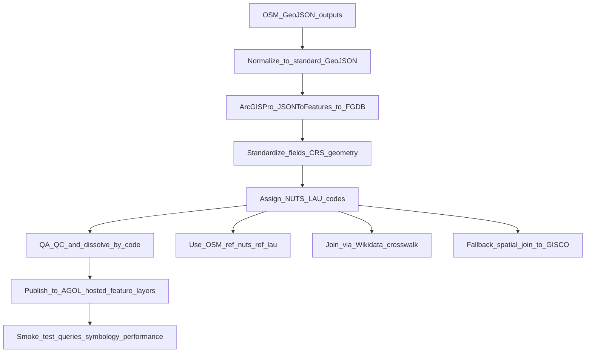

## Goal

Create authoritative, query-friendly boundary feature layers in ArcGIS Online for Europe using NUTS nomenclature:

- **NUTS0 (country)**
- **NUTS1–NUTS3**
- **LAU**

Inputs are the generated OSM-derived boundary GeoJSON outputs from the existing pipeline plan `[.cursor/plans/planet_osm_to_geojson_78589cf3.plan.md](.cursor/plans/planet_osm_to_geojson_78589cf3.plan.md)`.

## Key decisions (locked)

- **Publishing target**: ArcGIS Online hosted feature layers.
- **Output packaging**: Separate layers/feature classes per level (NUTS0, NUTS1, NUTS2, NUTS3, LAU).

## High-level workflow

## Inputs and expected file formats

- **OSM boundary GeoJSON**: Ensure inputs are **standard GeoJSON FeatureCollection** files with `.geojson` extension.
  - The existing pipeline plan outputs `geojsonseq` (`.geojsonl`) in places; ArcGIS Pro’s `JSON To Features` expects `.geojson` FeatureCollection. Plan includes a normalization step to convert `.geojsonl` → `.geojson` (and optionally chunk).
- **Reference boundaries (GISCO/Eurostat)**:
  - NUTS boundaries for the relevant year (NUTS0–3)
  - LAU boundaries for the relevant year
  - (Optionally) country/ISO lookup tables

## Output data products

- **Local**: File Geodatabase (FGDB) workspace containing feature classes:
  - `NUTS0`, `NUTS1`, `NUTS2`, `NUTS3`, `LAU`
- **ArcGIS Online**: Hosted feature layers (one item per level), published from the FGDB feature classes.

## Data model (minimum recommended fields)

Common fields across all levels (add level-specific as needed):

- **Identifiers**: `nuts_id` (for NUTS), `lau_id` (for LAU), `level` (0/1/2/3/LAU)
- **Names**: `name`, `name_en` (if available), `alt_name` (optional)
- **Country**: `cntr_code` (ISO2), `cntr_name`
- **OSM provenance**: `osm_id`, `osm_admin_level`, `osm_wikidata`, `osm_source`
- **Match/provenance**: `code_method` (ref|wikidata|spatial), `match_score` (numeric), `ref_year` (GISCO vintage)
- **Geometry metrics** (computed in equal-area CRS): `area_sqkm`, `perimeter_km`

## Hybrid code attribution strategy (recommended)

Prioritize methods by reliability and cost:

1. **OSM explicit codes**
  - If present, read `ref:nuts` / `ref:lau` (and any existing standardized code fields).
  - Validate format + infer level where possible.
2. **Wikidata join**
  - If `wikidata` is present, join to a pre-built crosswalk table that maps `wikidata_id → NUTS/LAU code`.
  - Build crosswalk from Wikidata SPARQL (repeatable notebook step) and cache as CSV/FGDB table.
3. **GISCO spatial fallback**
  - For remaining features, spatially match to GISCO boundaries:
    - Project to an equal-area CRS for area-overlap calculations.
    - Compute overlap (Intersect) and assign the GISCO unit with maximum overlap.
    - Apply thresholds (e.g., overlap ≥ 0.60) and flag low-confidence matches for review.

## ArcGIS Pro geoprocessing approach

Use ArcGIS Pro + arcpy in notebooks/scripts:

- **Normalize**
  - Convert `.geojsonl` to `.geojson` FeatureCollection per country+level.
  - If needed, chunk large `.geojson` using the existing tool `[chunker/chunk_geojson.py](chunker/chunk_geojson.py)` and later `Merge` chunks into one feature class per level.
- **Import**
  - Use ArcGIS Pro `JSON To Features` (arcpy `arcpy.conversion.JSONToFeatures`) with `POLYGON` geometry.
- **Standardize**
  - `Repair Geometry`, `Multipart To Singlepart` (if needed), `Project` to working CRS.
  - Add/rename fields, compute geometry metrics.
- **Assign codes**
  - Field calculations and joins for methods (ref → wikidata → spatial).
- **QA/QC + finalize**
  - Remove duplicates (by code + geometry), dissolve by `nuts_id`/`lau_id`.
  - Validate coverage counts vs GISCO (sanity check per country and per level).
- **Publish**
  - Publish each level feature class as an AGOL hosted feature layer.
  - Ensure item metadata (title, tags, summary), sharing settings, and layer capabilities (query, export if desired).

## Suggested workspace layout

- `arcgis/`
  - `notebooks/`
    - `01_normalize_geojson.ipynb`
    - `02_import_to_fgdb.ipynb`
    - `03_assign_nuts_lau.ipynb`
    - `04_qaqc_finalize.ipynb`
    - `05_publish_agol.ipynb`
  - `scripts/` (optional parameterized `.py` equivalents)
  - `config/` (years, paths, thresholds)
  - `data/` (GISCO inputs, cached crosswalks)
  - `outputs/` (FGDB, intermediate feature classes)

## Operational guidance

- **Versioning**: Pick a GISCO/NUTS vintage year and keep it consistent across NUTS and LAU.
- **Performance**: Process per-country, then append into global level feature classes; use chunking for very large countries.
- **Reproducibility**: Maintain a processing log (CSV/JSON) with per-country status and match statistics.

## Acceptance criteria

- Separate AGOL hosted feature layers exist for **NUTS0, NUTS1, NUTS2, NUTS3, LAU**.
- Each layer:
  - Has valid polygon geometry and consistent CRS.
  - Includes required ID/name/country fields.
  - Has documented attribution method and match confidence.
  - Supports fast map display and attribute queries in ArcGIS web apps.

