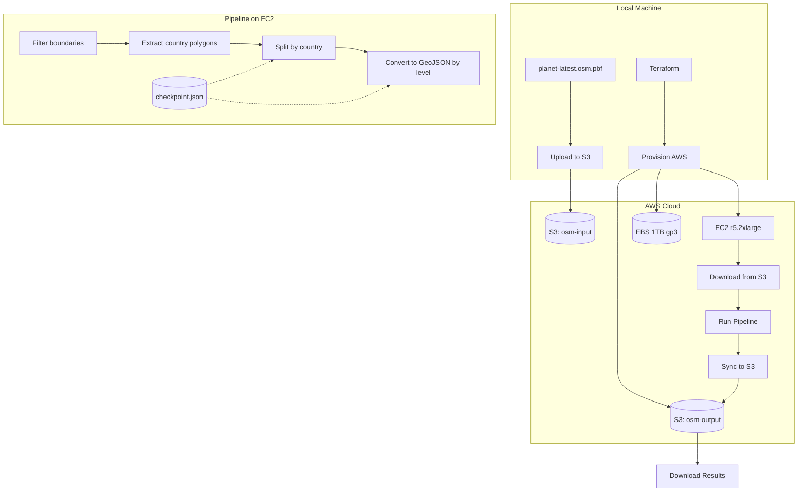

# Planet OSM PBF to GeoJSON Conversion Pipeline (AWS)

## Architecture Overview




## AWS Infrastructure (Terraform)

### Resource Summary

- **EC2 Instance**: r5.2xlarge (8 vCPU, 64 GB RAM) - memory-optimized for osmium
- **EBS Volume**: 1 TB gp3 with 3000 IOPS, 500 MB/s throughput
- **S3 Buckets**: Input (planet file) and Output (GeoJSON results)
- **Spot Instance**: Optional 60-70% cost savings (with interruption handling)
- **IAM Role**: EC2 access to S3 buckets

### Estimated Costs

- **EC2 r5.2xlarge On-Demand**: ~$0.504/hour ($12/day)
- **EC2 r5.2xlarge Spot**: ~$0.15-0.20/hour ($4-5/day)
- **EBS 1TB gp3**: ~~$80/month (~~$3/day)
- **S3 Storage**: ~$0.023/GB/month
- **Data Transfer**: S3 to EC2 in same region = free

**For a 48-72 hour run**: ~$50-100 total (Spot) or ~$100-150 (On-Demand)

---

## Terraform Configuration

### Directory Structure

```
F:\OSM\
  terraform/
    main.tf              # Provider, backend config
    variables.tf         # Configurable parameters
    vpc.tf               # VPC, subnet, security group
    ec2.tf               # EC2 instance, EBS volume
    s3.tf                # S3 buckets for input/output
    iam.tf               # IAM role for EC2 to access S3
    outputs.tf           # Instance IP, S3 bucket names
    user_data.sh         # Cloud-init bootstrap script
  pipeline/
    pipeline.py          # Main orchestrator
    config.py            # Settings and mappings
    requirements.txt     # Python dependencies
```

### Key Terraform Resources

**terraform/ec2.tf** - EC2 with Spot pricing:

```hcl
resource "aws_instance" "osm_processor" {
  ami                  = data.aws_ami.ubuntu.id
  instance_type        = var.instance_type  # r5.2xlarge
  iam_instance_profile = aws_iam_instance_profile.ec2_s3_profile.name
  
  instance_market_options {
    market_type = "spot"
    spot_options {
      max_price          = var.spot_max_price  # e.g., "0.25"
      spot_instance_type = "persistent"
    }
  }
  
  root_block_device {
    volume_size = 50
    volume_type = "gp3"
  }
  
  user_data = file("${path.module}/user_data.sh")
  
  tags = { Name = "osm-geojson-processor" }
}

resource "aws_ebs_volume" "data" {
  availability_zone = aws_instance.osm_processor.availability_zone
  size              = var.ebs_size_gb  # 1000
  type              = "gp3"
  iops              = 3000
  throughput        = 500
  
  tags = { Name = "osm-data-volume" }
}

resource "aws_volume_attachment" "data_attach" {
  device_name = "/dev/xvdf"
  volume_id   = aws_ebs_volume.data.id
  instance_id = aws_instance.osm_processor.id
}
```

**terraform/user_data.sh** - Bootstrap script:

```bash
#!/bin/bash
set -e

# Update and install dependencies
apt-get update
apt-get install -y osmium-tool python3-pip awscli

# Install Python packages
pip3 install pyosmium shapely geojson tqdm boto3

# Mount EBS data volume
mkfs -t ext4 /dev/xvdf || true  # Skip if already formatted
mkdir -p /data
mount /dev/xvdf /data
echo '/dev/xvdf /data ext4 defaults,nofail 0 2' >> /etc/fstab

# Create working directories
mkdir -p /data/{input,countries,output,temp,country_polygons}
chown -R ubuntu:ubuntu /data

# Download pipeline scripts from S3
aws s3 cp s3://${S3_BUCKET}/pipeline/ /home/ubuntu/pipeline/ --recursive
chmod +x /home/ubuntu/pipeline/*.py

echo "Setup complete" > /data/setup_complete.txt
```

### S3 Bucket Configuration

**terraform/s3.tf**:

```hcl
resource "aws_s3_bucket" "osm_data" {
  bucket = "osm-geojson-${random_id.suffix.hex}"
  
  tags = { Name = "osm-geojson-data" }
}

resource "aws_s3_bucket_lifecycle_configuration" "cleanup" {
  bucket = aws_s3_bucket.osm_data.id
  
  rule {
    id     = "cleanup-temp"
    status = "Enabled"
    filter { prefix = "temp/" }
    expiration { days = 7 }
  }
}
```

---

## Pipeline Stages (Run on EC2)

### Stage 1: Download Planet File and Extract Boundaries

```bash
# Download from S3 to EBS
aws s3 cp s3://osm-geojson-xxx/input/planet-latest.osm.pbf /data/input/

# Filter boundary relations (reduces ~70GB to ~3GB)
osmium tags-filter -t -o /data/boundaries.osm.pbf \
  /data/input/planet-latest.osm.pbf r/boundary=administrative
```

### Stage 2: Extract Country Polygons (admin_level=2)

```bash
osmium tags-filter -t -o /data/admin_level_2.osm.pbf \
  /data/boundaries.osm.pbf r/admin_level=2
osmium export /data/admin_level_2.osm.pbf -o /data/countries.geojson
```

Python script splits `countries.geojson` into individual country polygon files.

### Stage 3: Split Planet by Country

Osmium extract with country polygons to create per-country PBF files:

```bash
osmium extract --strategy=smart \
  --polygon=/data/country_polygons/US.geojson \
  --output=/data/countries/US.osm.pbf \
  /data/input/planet-latest.osm.pbf
```

Uses batch config file for efficiency (processes multiple countries per planet scan).

### Stage 4: Convert Each Country to GeoJSON by Admin Level

```bash
# For each country and level:
osmium tags-filter -t -o /data/temp/US_level_4.osm.pbf \
  /data/countries/US.osm.pbf r/admin_level=4
  
osmium export /data/temp/US_level_4.osm.pbf \
  --output-format=geojsonseq \
  -o /data/output/US/level_4.geojsonl

# Sync completed files to S3 periodically
aws s3 sync /data/output/ s3://osm-geojson-xxx/output/
```

### Global Levels (admin_level=1-2)

Admin levels 1-2 (supranational/country) output as global files:

```bash
osmium tags-filter -t -o /data/global_level_1.osm.pbf \
  /data/boundaries.osm.pbf r/admin_level=1
osmium export /data/global_level_1.osm.pbf \
  -o /data/output/global/level_1.geojsonl
```

---

## Restartability Design

A Python orchestrator script will track progress via `checkpoint.json`:

```json
{
  "stage": "country_extract",  
  "completed_countries": ["AD", "AE", "AF"],
  "current_country": "US",
  "completed_levels": {"US": [2, 3, 4], "DE": [2, 3, 4, 5, 6, 7, 8]},
  "last_s3_sync": "2026-01-27T15:30:00Z"
}
```

The orchestrator will:

1. Download checkpoint from S3 on startup (if exists)
2. Skip already-completed countries/levels
3. Save checkpoint locally after each country/level completes
4. Sync checkpoint to S3 every 10 minutes
5. Sync completed output files to S3 periodically
6. Handle Spot Instance interruptions gracefully (2-minute warning)

### Spot Instance Interruption Handling

```python
# Check for spot termination notice
def check_spot_termination():
    try:
        response = requests.get(
            "http://169.254.169.254/latest/meta-data/spot/termination-time",
            timeout=1
        )
        if response.status_code == 200:
            # Save checkpoint and sync to S3 immediately
            save_checkpoint()
            sync_to_s3()
            return True
    except:
        pass
    return False
```

---

## Output Structure (S3)

```
s3://osm-geojson-xxx/
  input/
    planet-latest.osm.pbf
  output/
    global/
      level_1.geojsonl        # Supranational (rare)
      level_2.geojsonl        # Country borders
    US/
      level_4.geojsonl        # States
      level_6.geojsonl        # Counties
      level_8.geojsonl        # Cities/towns
      ...
    DE/
      level_4.geojsonl        # Bundesländer
      level_6.geojsonl        # Kreise
      ...
    (200+ country folders)
  checkpoint.json
  logs/
    pipeline.log
```

---

## Key Files to Create

### Terraform Infrastructure

| File | Purpose |

|------|---------|

| `terraform/main.tf` | Provider config, backend |

| `terraform/variables.tf` | Configurable parameters |

| `terraform/vpc.tf` | VPC, subnet, security group |

| `terraform/ec2.tf` | EC2 instance, EBS volume |

| `terraform/s3.tf` | S3 buckets |

| `terraform/iam.tf` | IAM role for S3 access |

| `terraform/outputs.tf` | Instance IP, bucket names |

| `terraform/user_data.sh` | Bootstrap script |

### Pipeline Scripts

| File | Purpose |

|------|---------|

| `pipeline/pipeline.py` | Main orchestrator with checkpoint logic |

| `pipeline/config.py` | Paths, admin level mappings |

| `pipeline/extract_countries.py` | Split country polygons |

| `pipeline/requirements.txt` | Python dependencies |

---

## Deployment Workflow

### 1. Initial Setup (Local)

```powershell
# Install Terraform (if not installed)
winget install HashiCorp.Terraform

# Install AWS CLI and configure
aws configure  # Enter your AWS credentials
```

### 2. Upload Planet File to S3

```powershell
# Create bucket and upload (one-time, before terraform)
aws s3 mb s3://osm-geojson-input-YOUR_ID
aws s3 cp F:\OSM\planet-latest.osm.pbf s3://osm-geojson-input-YOUR_ID/input/
```

### 3. Deploy Infrastructure

```powershell
cd F:\OSM\terraform
terraform init
terraform plan
terraform apply
```

### 4. Connect and Run Pipeline

```powershell
# Get instance IP from Terraform output
$INSTANCE_IP = terraform output -raw instance_public_ip

# SSH into instance (use key pair created by Terraform)
ssh -i osm-processor-key.pem ubuntu@$INSTANCE_IP

# On EC2: Run the pipeline
cd /home/ubuntu/pipeline
python3 pipeline.py
```

### 5. Monitor Progress

```bash
# Watch logs
tail -f /data/logs/pipeline.log

# Check checkpoint
cat /data/checkpoint.json

# Check S3 sync status
aws s3 ls s3://osm-geojson-xxx/output/ --recursive | wc -l
```

### 6. Download Results

```powershell
# Sync completed GeoJSON files to local machine
aws s3 sync s3://osm-geojson-xxx/output/ F:\OSM\output\
```

### 7. Teardown (Important - Avoid Ongoing Costs)

```powershell
cd F:\OSM\terraform
terraform destroy
```

---

## Error Handling

| Error Type | Mitigation |

|------------|------------|

| Spot interruption | 2-minute warning triggers checkpoint save and S3 sync |

| Disk full | Check EBS space before each major operation |

| Corrupt output | Validate GeoJSON line count before marking complete |

| Memory issues | Process countries in batches, use streaming export |

| Network issues | Retry S3 operations with exponential backoff |

---

## Performance Estimates (r5.2xlarge)

| Stage | Duration |

|-------|----------|

| Planet boundary filter | ~15-20 min |

| Country polygon extraction | ~5 min |

| Per-country extraction | ~2-15 min each |

| Level filtering + export | ~30s-3 min per level |

| S3 sync | Continuous background |

| **Total estimated time** | **24-48 hours** |

The pipeline is fully restartable - if the Spot instance is interrupted or you stop processing, simply run `terraform apply` again and the pipeline will resume from the last checkpoint.